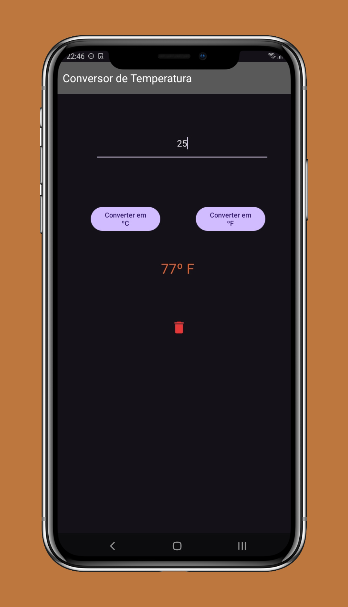
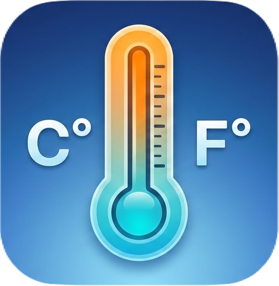

# 🌡️ Conversor de Temperatura Dual

Um aplicativo Android simples e intuitivo para conversão instantânea entre as escalas **Celsius (°C)** e **Fahrenheit (°F)**. Este projeto foi desenvolvido para praticar conceitos fundamentais de desenvolvimento Android, como layouts dinâmicos, manipulação de inputs e lógica de conversão.

---

## 🚀 Funcionalidades

- **Conversão de Mão Dupla:** Converta de Celsius para Fahrenheit e vice-versa com apenas um clique.
- **Formatação Inteligente:** Resultados exibidos com uma casa decimal, ocultando o zero desnecessário para números inteiros (ex: `25.0` vira `25`).
- **Feedback Visual:** Botão de limpeza rápido (ícone de lixeira) para resetar o cálculo e o input.
- **Interface Moderna:** Tema escuro (Dark Mode) nativo com Toolbar personalizada.
- **Acessibilidade:** Suporte a leitores de tela via `contentDescription`.

---

## 📸 Demonstração

|                   Interface Principal                    |                 Ícone do Projeto                 |
|:--------------------------------------------------------:|:------------------------------------------------:|
|  |  |

---

## 🛠️ Tecnologias e Ferramentas

- **Linguagem:** Kotlin
- **Layout:** [ConstraintLayout](https://developer.android.com/reference/androidx/constraintlayout/widget/ConstraintLayout) para um design responsivo.
- **IDE:** Android Studio.

---

## 📐 Lógica de Conversão

O cálculo matemático utilizado segue as fórmulas padrões:

- **Celsius para Fahrenheit:** F = C * 1.8 + 32

- **Fahrenheit para Celsius:** C = (F - 32) * (5/9)